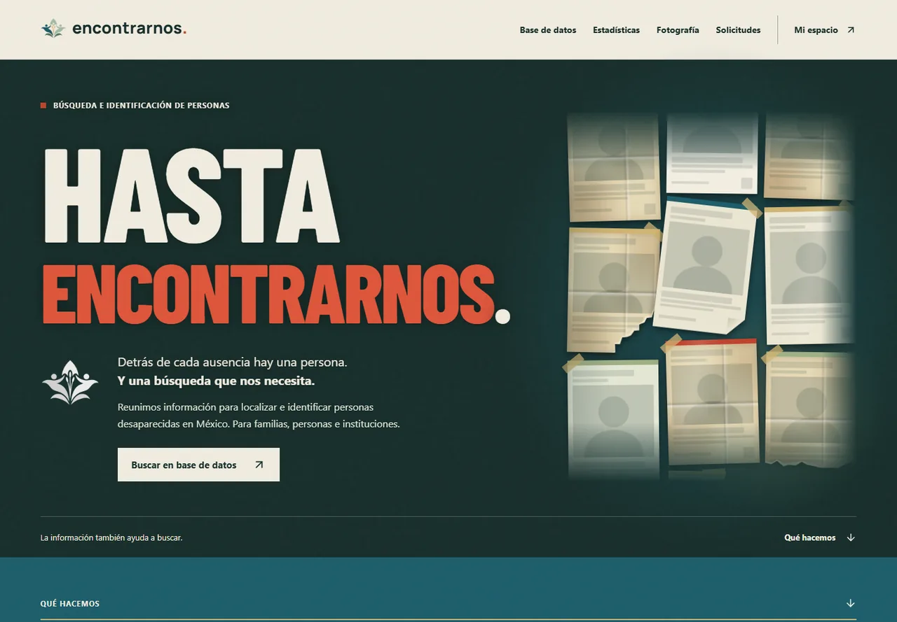
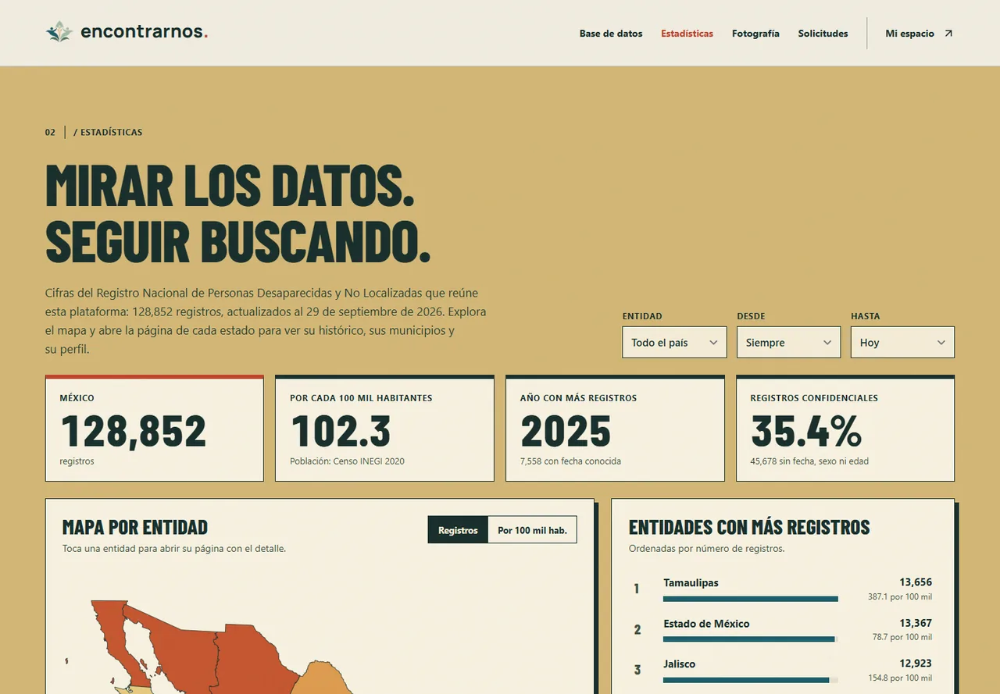
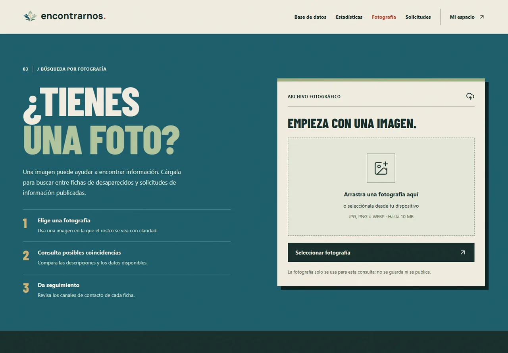
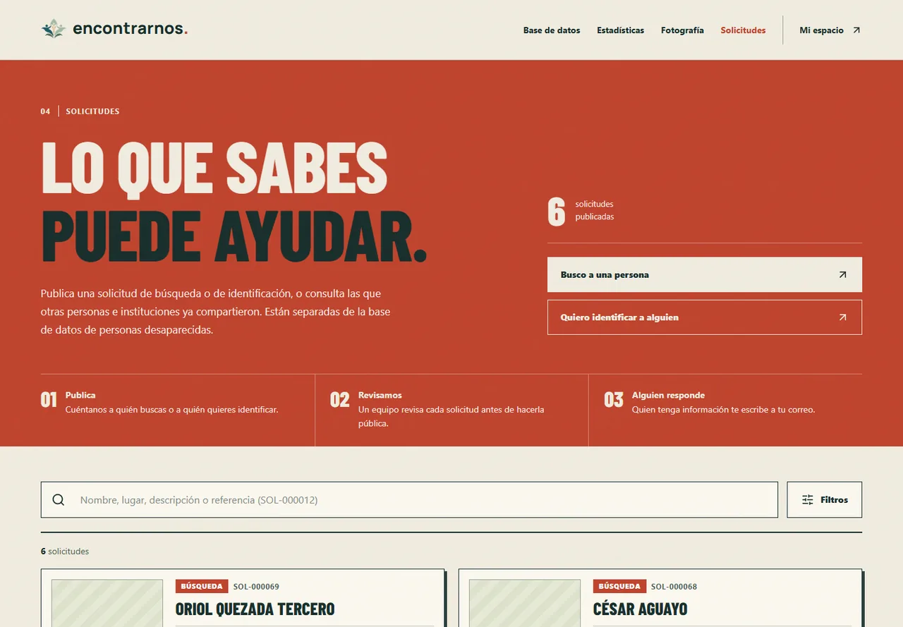
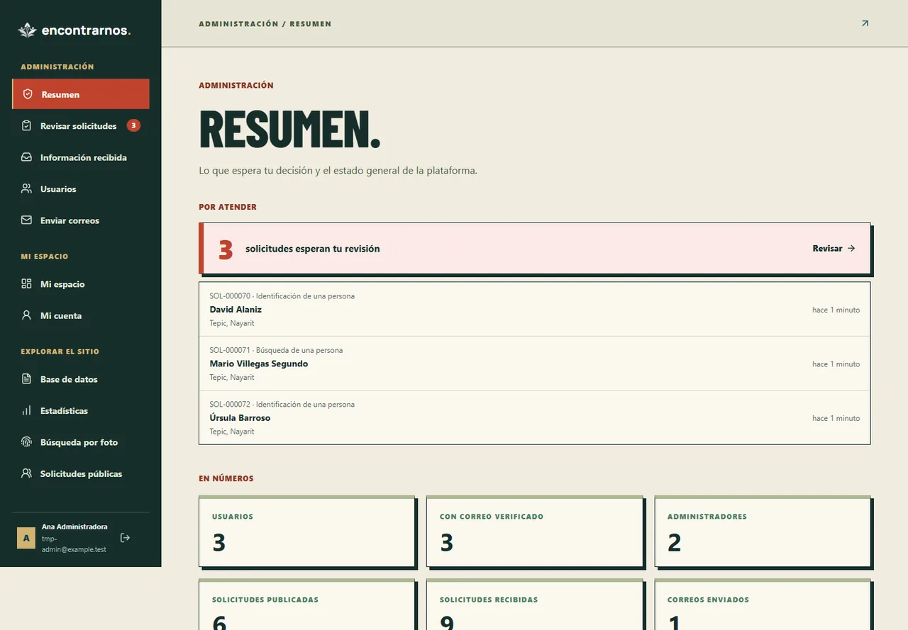
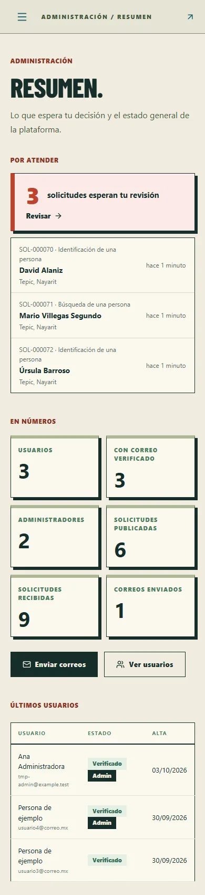
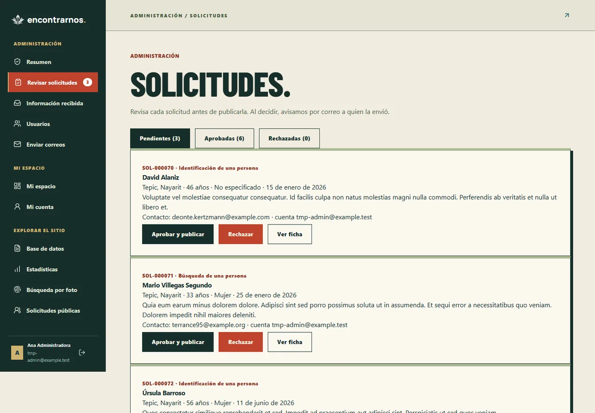
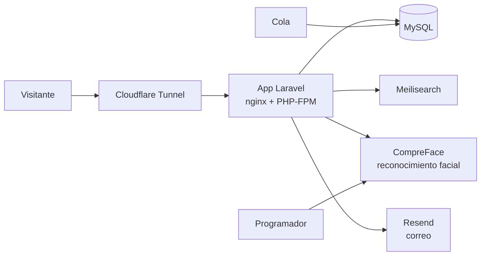

<p align="center">
  
</p>

# HASTA ENCONTRARNOS.

**La información también ayuda a buscar.**

Encontrarnos es una plataforma para apoyar la búsqueda e identificación de personas desaparecidas en México. Está pensada para familias, personas particulares, hospitales, centros de rehabilitación, servicios forenses e instituciones de seguridad. Es un proyecto escolar, publicado en [www.encontrarnos.lat](https://www.encontrarnos.lat).



## Qué hace

| Sección | Qué ofrece |
| --- | --- |
| **Base de datos** | Más de 76 mil fichas públicas del Registro Nacional de Personas Desaparecidas y No Localizadas, con búsqueda tolerante a errores de escritura, filtros (estado, municipio, sexo, edad, fechas, autoridad, nacionalidad, con fotografía) y fichas completas. |
| **Estadísticas** | Cifras de 128,852 registros: mapa por entidad, municipios, tendencia por año, perfil por sexo y edad, y tasa por cada 100 mil habitantes. |
| **Búsqueda por fotografía** | Compara el rostro de una imagen con las fichas y las solicitudes publicadas. La imagen solo se usa para la consulta: no se guarda ni se publica. |
| **Solicitudes** | Cualquier persona puede enviar una solicitud de búsqueda o de identificación. Un administrador la revisa antes de publicarla y avisamos por correo a quien la envió. |
| **Información** | Quien tenga una cuenta verificada puede enviar datos sobre una ficha o una solicitud desde la propia página; llegan al administrador o a quien publicó la solicitud. |
| **Mi espacio** | Con una cuenta, cada persona gestiona sus solicitudes: editar, cerrar, reabrir, eliminar y marcar como atendida la información recibida. |
| **Administración** | Resumen de pendientes, revisión de solicitudes, usuarios y roles, información recibida y envío de correos a la comunidad. |

<table>
  <tr>
    <td width="50%"></td>
    <td width="50%"></td>
  </tr>
  <tr>
    <td align="center"><sub>Estadísticas del registro nacional</sub></td>
    <td align="center"><sub>Búsqueda por fotografía</sub></td>
  </tr>
  <tr>
    <td width="50%"></td>
    <td width="50%"></td>
  </tr>
  <tr>
    <td align="center"><sub>Solicitudes (datos de ejemplo)</sub></td>
    <td align="center"><sub>Panel de administración (datos de ejemplo)</sub></td>
  </tr>
</table>

<table>
  <tr>
    <td align="center"><br><sub>Inicio en el teléfono</sub></td>
    <td align="center"><br><sub>Panel en el teléfono</sub></td>
  </tr>
</table>

> Las capturas de solicitudes y del panel usan cuentas y personas ficticias. Las fichas reales no se muestran aquí.

### El panel de administración

El resumen empieza por lo que espera una decisión: cuántas solicitudes hay por revisar (con las más antiguas primero) y cuántos usuarios no han verificado su correo. El menú lateral lleva una insignia con las solicitudes pendientes.



Al aprobar o rechazar una solicitud se envía un correo a quien la mandó. El primer administrador se crea con `php artisan admin:create correo@ejemplo.com`.

## Cómo está armado



- **Backend:** Laravel 13 y PHP 8.3. Las rutas de consulta, fotografía, solicitudes y recuperación de contraseña tienen límite de peticiones (`throttle`); las de administración exigen cuenta verificada y rol de administrador.
- **Frontend:** React 18, TypeScript, Inertia 2, Vite y Tailwind CSS, con CSS propio para la identidad.
- **Búsqueda:** Meilisearch con respaldo a `FULLTEXT` de MySQL si no responde.
- **Reconocimiento facial:** CompreFace 1.2 con GPU. Con `COMPREFACE_AUTO_INDEX=true`, un trabajo por hora (`faces:index`) mantiene al día los rostros de fichas y solicitudes públicas.
- **Datos:** el colector del registro nacional ya terminó. Su copia completa (13 tablas, verificada fila por fila) vive en la base `rnpdno` de MySQL; la app trabaja con la base `encontrarnos`.
- **Correo:** Resend, con SPF, DKIM y DMARC del dominio.

### Privacidad

- Las fichas marcadas como confidenciales muestran solo estado y municipio.
- Nacimiento y domicilio solo los ve un administrador (`RECORDS_SENSITIVE=admins`). Para el resto no aparece ningún aviso en su lugar.
- Con `RECORDS_PUBLISH=registry` solo se publican las fichas que el propio registro autoriza.
- Las solicitudes no se publican hasta que un administrador las aprueba, y el contacto nunca es público.
- La recuperación de contraseña responde igual exista o no el correo, y tiene límite de intentos.

## Poner en marcha con Docker

`compose.yaml` levanta todo junto: app, cola, programador, MySQL 8.4, Meilisearch y CompreFace (`compose.compreface.yaml`, con GPU NVIDIA). Los datos viven en volúmenes de Docker.

```powershell
Copy-Item .env.docker.example .env.docker   # completa contraseñas, APP_KEY y COMPREFACE_API_KEY
docker compose --env-file .env.docker up -d --build
docker compose --env-file .env.docker exec app php artisan admin:create tu@correo.com
```

Usa siempre `--env-file .env.docker`: sin él Compose lee el `.env` de desarrollo. La app queda en `http://127.0.0.1:8080` y migra sola al arrancar. Crea la aplicación de reconocimiento en la interfaz de CompreFace (`http://127.0.0.1:8001`) para obtener `COMPREFACE_API_KEY`.

| Servicio | Puerto local | Cambia con |
| --- | --- | --- |
| App | 8080 | `APP_PORT` |
| CompreFace (interfaz) | 8001 | `compose.compreface.yaml` |
| MySQL | 3307 | `MYSQL_PORT` |

Todos escuchan solo en `127.0.0.1`. En Windows, [scripts/iniciar.ps1](scripts/iniciar.ps1) arranca Docker Desktop si hace falta, levanta el stack y abre el sitio; sirve para un acceso directo en el escritorio.

### Publicarlo con Cloudflare Tunnel

1. Instala `cloudflared` como servicio con el token de tu túnel.
2. En **Published application routes** agrega tu dominio con servicio HTTP `127.0.0.1:8080`. Si ya existe un registro DNS viejo para ese nombre, bórralo primero.
3. En `.env.docker` pon `APP_URL=https://www.tu-dominio` y `TRUSTED_PROXIES=*`, para que Laravel reconozca el `https` que llega por el túnel. Si `APP_URL` lleva `www.`, el dominio sin `www.` redirige solo.

### Que Docker no llene C:

Imágenes y volúmenes viven dentro del disco virtual de Docker Desktop (`docker_data.vhdx`). Para moverlo: Docker Desktop → Settings → Resources → Advanced → **Disk image location**. Para recuperar espacio dentro de él: `docker image prune` y `docker builder prune`.

## Desarrollo local

Necesitas PHP 8.3+ con las extensiones de Laravel, Composer y Node.js 24 (con npm 11.6, la versión con la que se generó `package-lock.json`). Puedes trabajar desde Laragon.

```powershell
composer install
npm.cmd ci
Copy-Item .env.example .env
php artisan key:generate
if (!(Test-Path database/database.sqlite)) { New-Item database/database.sqlite -ItemType File }
php artisan migrate
```

La configuración de ejemplo usa SQLite. Para probar la búsqueda de texto completo hace falta MySQL (ver `RECORDS_FULLTEXT`). Después, en dos terminales:

```powershell
php artisan serve
npm.cmd run dev
```

Para generar los archivos de producción: `npm.cmd run build` (comprueba TypeScript y escribe en `public/build`).

### Pruebas y estilo

```powershell
php artisan test        # usa SQLite en memoria y no necesita servicios externos
vendor/bin/pint         # estilo de PHP
npx tsc --noEmit        # tipos de TypeScript
npx prettier --check resources/js
```

### Comandos de mantenimiento

| Comando | Para qué sirve |
| --- | --- |
| `admin:create {correo}` | Crea o convierte un administrador con el correo ya verificado. |
| `requests:review {SOL-000001?} {approve\|reject?}` | Lista, aprueba o rechaza solicitudes desde la terminal. |
| `records:index [--fresh]` | Sincroniza el índice de Meilisearch con las fichas públicas. |
| `records:publication {all\|registry}` | Publica u oculta fichas según lo que autoriza el registro. |
| `records:import-rnpdno` | Importa fichas desde el colector (solo lectura). Ya no tiene origen: el SQLite se retiró. |
| `records:import-rnpdno-statistics` | Resume el listado completo en los conteos de estadísticas. |
| `records:backup-rnpdno` | Copia las 13 tablas del colector a la base `rnpdno` y verifica filas y bytes. |
| `faces:index [--prune]` | Sincroniza los rostros de fichas y solicitudes con CompreFace. |
| `faces:recover {informe}` | Reintenta solo las fotos rechazadas (escalado y giros), sin elegir rostros de grupos. |

## Identidad visual

La interfaz toma elementos del cartel de búsqueda y del archivo: papel, tinta, titulares grandes, divisiones marcadas, fichas y composiciones superpuestas. El lenguaje es directo y está centrado en las personas.

| Color | Valor | Uso |
| --- | --- | --- |
| Papel | `#F0ECDF` | Fondo principal y superficies claras |
| Tinta | `#172E2B` | Texto, navegación y secciones oscuras |
| Rojo | `#BF432D` | Titulares, acentos y solicitudes |
| Verde salvia | `#9EAF85` | Participación y fondos de retratos |
| Ocre | `#D0B371` | Estadísticas y acentos |
| Azul petróleo | `#1C5D6B` | Color de identidad complementario |

- **Marca:** Manrope 800, con espaciado de `0.01em` y punto rojo.
- **Titulares:** Barlow Condensed 800, en mayúsculas; fuentes locales en `public/fonts`.
- **Texto y controles:** fuente del sistema para una lectura clara.
- **Móvil:** navegación inferior para las acciones principales y controles de al menos 44 px.
- **Accesibilidad:** foco visible, etiquetas de formulario y respeto a la preferencia de movimiento reducido.

| Recurso de marca | Descarga |
| --- | --- |
| Símbolo y nombre, fondo transparente | [PNG](public/encontrarnos-marca.png) · [SVG](public/encontrarnos-marca.svg) |
| Nombre convertido a trazos | [SVG vectorial](public/encontrarnos-nombre.svg) |
| Símbolo original en color | [PNG](public/1.png) |
| Símbolo para fondos claros | [PNG](public/2.png) |
| Símbolo para fondos oscuros | [PNG](public/3.png) |
| Imagen al compartir el enlace (1200×630) | [PNG](public/og-image.png) |

## Dónde editar

| Archivo | Contenido |
| --- | --- |
| [routes/web.php](routes/web.php) | Todas las rutas públicas, de usuario y de administración |
| [app/Http/Controllers/Admin](app/Http/Controllers/Admin) | Panel de administración |
| [PersonRecordResource.php](app/Http/Resources/PersonRecordResource.php) | Lista blanca de campos públicos de una ficha |
| [app/Services](app/Services) | Búsqueda, reconocimiento facial, estadísticas y lectura del registro |
| [Welcome.tsx](resources/js/Pages/Welcome.tsx) · [welcome.css](resources/js/Pages/welcome.css) | Página principal |
| [resources/js/Pages/Public](resources/js/Pages/Public) | Base de datos, fichas, estadísticas, fotografía y solicitudes |
| [resources/js/Pages/Admin](resources/js/Pages/Admin) · [WorkspaceLayout.tsx](resources/js/Layouts/WorkspaceLayout.tsx) | Panel y su menú lateral |
| [app.blade.php](resources/views/app.blade.php) | Etiquetas del `<head>`, incluida la vista previa al compartir el enlace |
| [resources/views/emails](resources/views/emails) | Plantillas de correo |

Los secretos de `.env` y `.env.docker`, la base de datos local, las dependencias y los compilados se excluyen de Git.

---

**QUE LA BÚSQUEDA NO SE DETENGA.**
