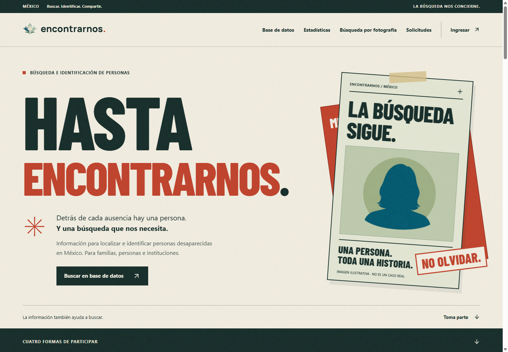

<p align="center">
  
</p>

# HASTA ENCONTRARNOS.

**La información también ayuda a buscar.**

Encontrarnos es un proyecto para apoyar la búsqueda e identificación de personas desaparecidas en México. Está pensado para personas particulares, familias, hospitales, centros de rehabilitación, servicios forenses e instituciones de seguridad.

La interfaz reúne cuatro acciones: **buscar en la base de datos, consultar estadísticas, buscar por fotografía y consultar o crear solicitudes de identificación.**

> **Estado del proyecto:** prototipo de interfaz en React. Las fichas y estadísticas utilizan datos de ejemplo. La fotografía tiene una vista previa local y las solicitudes permiten previsualizar su contenido; todavía no hay búsqueda de coincidencias ni publicación de solicitudes conectadas a un servicio. Incluye la estructura de autenticación de Laravel.

## LA BÚSQUEDA SIGUE.



## Identidad visual

La landing toma elementos del cartel de búsqueda y del archivo: papel, tinta, titulares grandes, divisiones marcadas, fichas y composiciones superpuestas. El lenguaje es directo y está centrado en las personas.

### Paleta de la landing

| Color | Valor | Uso |
| --- | --- | --- |
| Papel | `#F0ECDF` | Fondo principal y superficies claras |
| Tinta | `#172E2B` | Texto, navegación y secciones oscuras |
| Rojo | `#BF432D` | Titulares, acentos y solicitudes |
| Verde salvia | `#9EAF85` | Participación y fondos de retratos |
| Ocre | `#D0B371` | Estadísticas y acentos |
| Azul petróleo | `#1C5D6B` | Color de identidad complementario |

El símbolo original también utiliza `#9EBAA9` y `#4C7E5F`.

### Tipografía y composición

- **Marca:** Manrope 800, con espaciado de `0.01em` y punto rojo.
- **Titulares:** Barlow Condensed 800, en mayúsculas; archivo de fuente local.
- **Texto y controles:** fuente del sistema para una lectura clara.
- **Textura:** grano sutil sobre el fondo de papel.
- **Móvil:** navegación inferior para las cuatro acciones y controles de al menos 44 px.
- **Accesibilidad:** foco visible, etiquetas de formulario y adaptación a la preferencia de movimiento reducido.

### Archivos de marca

| Recurso | Descarga |
| --- | --- |
| Símbolo y nombre, fondo transparente | [PNG](public/encontrarnos-marca.png) · [SVG](public/encontrarnos-marca.svg) |
| Nombre convertido a trazos | [SVG vectorial](public/encontrarnos-nombre.svg) |
| Símbolo original en color | [PNG](public/1.png) |
| Símbolo para fondos claros | [PNG](public/2.png) |
| Símbolo para fondos oscuros | [PNG](public/3.png) |

El SVG de la marca completa contiene el símbolo PNG original y el nombre convertido a trazos. La versión del nombre es vectorial y no necesita fuentes instaladas.

## Desarrollo local

**Stack:** Laravel 13, PHP 8.3+, React 18, TypeScript, Inertia 2, Vite y Tailwind CSS 3. La identidad de la landing está definida principalmente en CSS propio.

Necesitas PHP con las extensiones de Laravel y SQLite, Composer y una versión de Node.js compatible con las dependencias de `package-lock.json`. Puedes trabajar desde Laragon.

### Preparación

Desde la raíz del proyecto, en PowerShell:

```powershell
composer install
npm.cmd ci
Copy-Item .env.example .env
php artisan key:generate
if (!(Test-Path database/database.sqlite)) {
    New-Item database/database.sqlite -ItemType File
}
php artisan migrate
```

La copia de `.env.example` corresponde a una instalación nueva. Conserva tu `.env` si ya configuraste el proyecto. La configuración de ejemplo utiliza SQLite para los servicios de Laravel.

### Ejecutar

En una terminal:

```powershell
php artisan serve
```

En otra terminal:

```powershell
npm.cmd run dev
```

Abre la dirección que indique Artisan. Si utilizas el servidor de Laragon, configura `APP_URL` con tu dominio local y mantén Vite ejecutándose durante el desarrollo.

### Compilar

```powershell
npm.cmd run build
```

Este comando comprueba TypeScript y genera los archivos de producción en `public/build`.

## Dónde editar

| Archivo | Contenido |
| --- | --- |
| [Welcome.tsx](resources/js/Pages/Welcome.tsx) | Página principal |
| [welcome.css](resources/js/Pages/welcome.css) | Identidad y adaptación móvil de la landing |
| [PublicTools.tsx](resources/js/Components/Encontrarnos/PublicTools.tsx) | Buscador, estadísticas, solicitudes y navegación |
| [public-tools.css](resources/js/Components/Encontrarnos/public-tools.css) | Estilos compartidos de esas herramientas |
| [GuestLayout.tsx](resources/js/Layouts/GuestLayout.tsx) | Estructura visual de acceso y registro |
| [Dashboard.tsx](resources/js/Pages/Dashboard.tsx) | Panel principal |
| [app.css](resources/css/app.css) | Fuentes y estilos globales |
| [public](public) | Logos, siluetas y recursos visuales |

Los secretos de `.env`, la base de datos local, dependencias, capturas de trabajo y compilados se excluyen de Git.

---

**QUE LA BÚSQUEDA NO SE DETENGA.**
